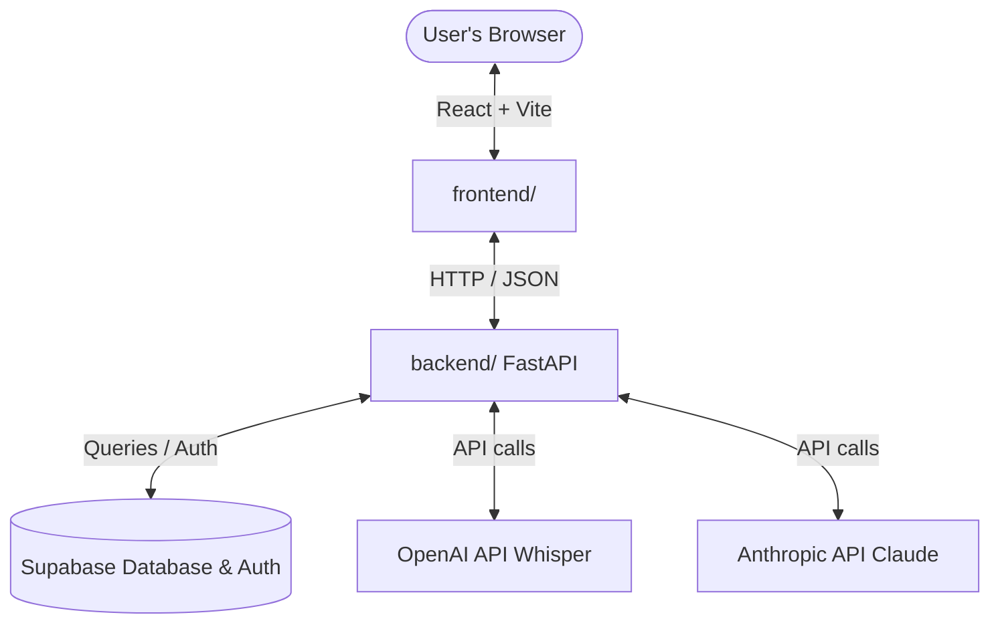

# Speakiq - Personalized AI Speech Improvement

Welcome to **Speakiq**! This repository contains both the frontend (React + Vite + TypeScript) and the backend (FastAPI/Python) services.

This guide outlines how multiple collaborators can set up, run, and collaborate on both the front-end and back-end codebases.

---

## 🛠️ Project Architecture Overview



* **Frontend:** Located in [frontend/](file:///c:/Users/GAMER/Desktop/speakiq/frontend/). It is a React application built with Vite, TypeScript, and TailwindCSS.
* **Backend:** Located in [backend/](file:///c:/Users/GAMER/Desktop/speakiq/backend/). It is a Python application (FastAPI) responsible for audio analysis, streak tracking, AI feedback generation, and database interactions.

---

## 👥 Collaboration & Git Workflow

Since you have added your team member as a collaborator on GitHub, follow this standard Git workflow to avoid merge conflicts and keep code organized.

### 1. Cloning the Repository
Your collaborator should clone the repository using:
```bash
git clone https://github.com/coder-jane06/Speakiq.git
cd Speakiq
```

### 2. Branching Policy (Do not commit directly to `main`)
To keep the main application stable, follow a feature-branch workflow:
* Create a new branch for every feature, fix, or experiment:
  ```bash
  # Make sure you are on the latest main branch
  git checkout main
  git pull origin main

  # Create and switch to your feature branch
  git checkout -b feature/your-feature-name
  # Or for bug fixes:
  git checkout -b bugfix/issue-description
  ```

### 3. Making and Committing Changes
Write code, test it locally, and then commit your changes:
```bash
git add .
git commit -m "feat: add user streak dashboard card"
```

### 4. Pushing and Creating a Pull Request (PR)
Push your feature branch to GitHub:
```bash
git push origin feature/your-feature-name
```
Go to [GitHub Speakiq Repository](https://github.com/coder-jane06/Speakiq) and click **"Compare & pull request"**. Describe your changes and request a review. Once approved, merge it into `main`.

### 5. Keeping Your Code Updated
Before starting new work or before making a PR, merge changes from `main` into your feature branch to resolve any conflicts early:
```bash
git checkout main
git pull origin main
git checkout feature/your-feature-name
git merge main
```

---

## 🐍 Backend Setup (`backend/`)

The backend is written in Python. It communicates with Supabase, OpenAI, and Anthropic.

### Prerequisites
* Python 3.10+ installed.
* `ffmpeg` installed on the system (needed for audio processing/transcribing).

### Setup Instructions
1. Navigate to the backend directory:
   ```bash
   cd backend
   ```
2. Create and activate a Python virtual environment:
   * **Windows (PowerShell):**
     ```powershell
     python -m venv venv
     .\venv\Scripts\Activate.ps1
     ```
   * **macOS / Linux:**
     ```bash
     python3 -m venv venv
     source venv/bin/activate
     ```
3. Install dependencies:
   ```bash
   pip install -r requirements.txt
   ```
4. Configure Environment Variables:
   * Copy the template environment file:
     ```bash
     cp .env.example .env
     ```
   * Open `.env` and fill in the secrets (Supabase credentials, OpenAI key, Anthropic key).
   * **CRITICAL:** **NEVER commit `.env` files to Git.** They are ignored by the project's `.gitignore` file automatically. Share credentials with team members securely (e.g., via password managers or secure messaging).
5. Start the backend development server:
   ```bash
   uvicorn main:app --reload --port 8000
   ```
   The backend will be running at `http://localhost:8000`.

---

## ⚛️ Frontend Setup (`frontend/`)

The frontend is a React + TypeScript app managed with Vite and styled using TailwindCSS.

### Prerequisites
* Node.js (version 18 or higher) and `npm` installed.

### Setup Instructions
1. Navigate to the frontend directory:
   ```bash
   cd frontend
   ```
2. Install npm dependencies:
   ```bash
   npm install
   ```
3. Configure Environment Variables:
   * Create a `.env` file inside the `frontend/` directory (you can copy values from the existing `.env` file).
   * It needs the following keys:
     ```env
     VITE_SUPABASE_URL=https://your-supabase-project.supabase.co
     VITE_SUPABASE_ANON_KEY=your-supabase-anon-key
     VITE_API_URL=http://localhost:8000
     ```
     *(Note: Change `VITE_API_URL` to your production backend URL, e.g., Hugging Face Space URL, when deploying to production).*
4. Start the frontend development server:
   ```bash
   npm run dev
   ```
   Open your browser and navigate to the local server address shown in the terminal (usually `http://localhost:5173`).

---

## 🚀 Deployment

* **Frontend:** Can be deployed to GitHub Pages using the built-in script:
  ```bash
  npm run deploy
  ```
  This builds the static files into `dist/` and pushes them to the `gh-pages` branch.
* **Backend:** Can be deployed to Hugging Face Spaces (or Render/Docker container platforms).
  * Check the deployment scripts (`hf_deploy.py` or `render.yaml`) for details.
